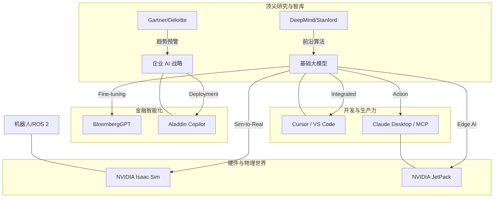

```mermaid
graph TD
    %% 节点定义
    subgraph S1 [顶尖研究与智库]
    G[Gartner/Deloitte] -->|趋势预警| Strategy[企业 AI 战略]
    DM[DeepMind/Stanford] -->|前沿算法| Base[基础大模型]
    end

    subgraph S2 [金融智能化]
    Base -->|Fine-tuning| BGPT[BloombergGPT]
    Strategy -->|Deployment| Aladdin[Aladdin Copilot]
    end

    subgraph S3 [开发与生产力]
    Base -->|Integrated| Cursor[Cursor / VS Code]
    Base -->|Action| Agent[Claude Desktop / MCP]
    end

    subgraph S4 [硬件与物理世界]
    Base -->|Sim-to-Real| Isaac[NVIDIA Isaac Sim]
    Base -->|Edge AI| Jetson[NVIDIA JetPack]
    end

    %% 关联
    Strategy --- Aladdin
    Base --- Cursor
    Agent --- Jetson
    Robotic[机器人/ROS 2] --- Isaac
```   