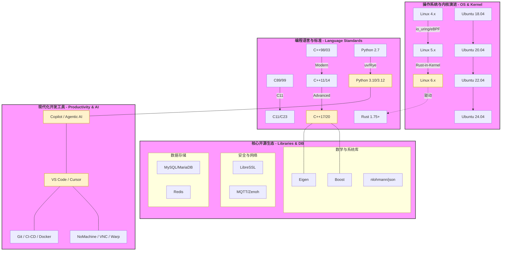

```mermaid
graph TB
    %% 全局样式定义
    classDef category fill:#f9f,stroke:#333,stroke-width:2px,font-weight:bold;
    classDef highlight fill:#fff2cc,stroke:#d6b656,stroke-width:2px;

    %% --- 第一层：底层基石与环境 ---
    subgraph Layer1 [操作系统与内核演进 - OS & Kernel]
        direction LR
        L4[Linux 4.x] -->|io_uring/eBPF| L5[Linux 5.x]
        L5 -->|Rust-in-Kernel| L6[Linux 6.x]
        U18[Ubuntu 18.04] --> U20[Ubuntu 20.04]
        U20 --> U22[Ubuntu 22.04]
        U22 --> U24[Ubuntu 24.04]
    end

    %% --- 第二层：核心语言与标准 ---
    subgraph Layer2 [编程语言与标准 - Language Standards]
        direction LR
        C89[C89/99] -->|C11| C11[C11/C23]
        Cpp98[C++98/03] -->|Modern| Cpp11[C++11/14]
        Cpp11 -->|Advanced| Cpp17[C++17/20]
        Py2[Python 2.7] -->|uv/Rye| Py3[Python 3.10/3.12]
        Rust[Rust 1.75+]
    end

    %% --- 第三层：核心生态与库 (居中布局) ---
    subgraph Layer3 [核心开源生态 - Libraries & DB]
        direction TB
        subgraph Libs [数学与系统库]
            Boost[Boost]
            Eigen[Eigen]
            Json[nlohmann/json]
        end
        subgraph Security [安全与网络]
            LSSL[LibreSSL]
            MQTT[MQTT/Zenoh]
        end
        subgraph Data [数据存储]
            MySQL[MySQL/MariaDB]
            Redis[Redis]
        end
    end

    %% --- 第四层：集成开发与 AI 智能 (生产力层) ---
    subgraph Layer4 [现代化开发工具 - Productivity & AI]
        direction LR
        IDE[VS Code / Cursor]
        Remote[NoMachine / VNC / Warp]
        AI[Copilot / Agentic AI]
        VCS[Git / CI-CD / Docker]
    end

    %% --- 逻辑关联连线 (关键路径) ---
    L6 -.->|驱动| Rust
    Cpp17 --- Eigen
    Cpp17 --- Boost
    Py3 --- AI
    IDE --- VCS
    IDE --- Remote
    AI --- IDE
    
    %% 应用样式
    class Layer1,Layer2,Layer3,Layer4 category;
    class L6,Cpp17,Py3,IDE,AI highlight;
```