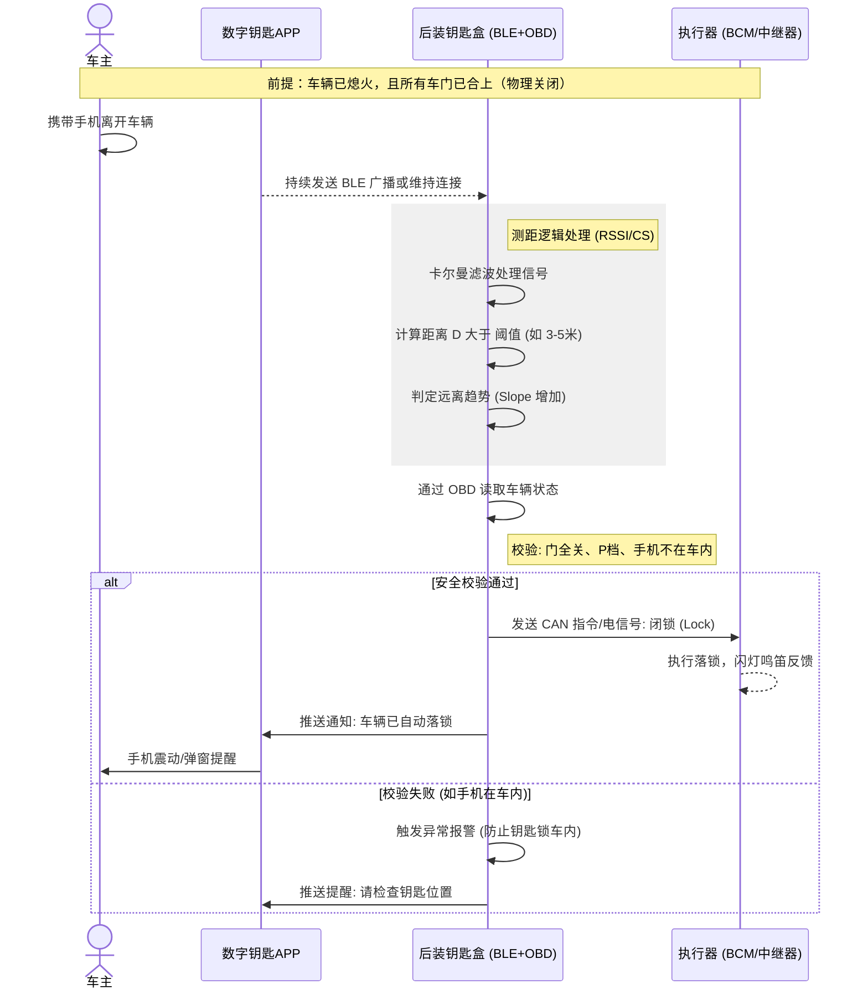

```mermaid
sequenceDiagram
    actor A as 车主
    participant B as 数字钥匙APP
    participant C as 后装钥匙盒 (BLE+OBD)
    participant D as 执行器 (BCM/中继器)

    Note over A,D: 前提：车辆已熄火，且所有车门已合上（物理关闭）
    
    %% Phase 1: 离开监控阶段
    A->>A: 携带手机离开车辆
    B-->>C: 持续发送 BLE 广播或维持连接
    
    rect rgb(240, 240, 240)
        Note right of C: 测距逻辑处理 (RSSI/CS)
        C->>C: 卡尔曼滤波处理信号
        C->>C: 计算距离 D 大于 阈值 (如 3-5米)
        C->>C: 判定远离趋势 (Slope 增加)
    end

    %% Phase 2: 安全校验
    C->>C: 通过 OBD 读取车辆状态
    Note right of C: 校验: 门全关、P档、手机不在车内
    
    %% Phase 3: 执行落锁逻辑
    alt 安全校验通过
        C->>D: 发送 CAN 指令/电信号: 闭锁 (Lock)
        D-->>D: 执行落锁，闪灯鸣笛反馈
        C->>B: 推送通知: 车辆已自动落锁
        B->>A: 手机震动/弹窗提醒
    else 校验失败 (如手机在车内)
        C->>C: 触发异常报警 (防止钥匙锁车内)
        C->>B: 推送提醒: 请检查钥匙位置
    end
```