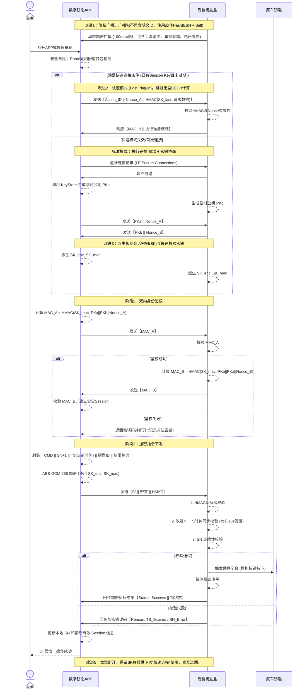

```mermaid
sequenceDiagram
    actor A as 车主
    participant B as 数字钥匙APP
    participant C as 后装钥匙盒
    participant D as 原车钥匙

    %% Phase 0：隐私广播阶段
    Note over B,C: 改进1：隐私广播。广播包不再含明文ID，使用旋转Hash(ESN + Salt)
    C->>B: 动态加密广播 (100ms间隙，包含：混淆ID、车锁状态、电压警告)
    
    %% Phase 1：环境自检与策略选择
    A->>B: 打开APP或靠近车辆
    B-->>B: 安全自检：Root/模拟器/重打包检测
    
    alt 满足快速连接条件 (已有Session Key且未过期)
        Note over B,C: 改进2：快速模式 (Fast Plug-in)，跳过重型ECDH计算
        B->>C: 发送【Action_ID || Nonce_A || HMAC(SK_last, 请求数据)】
        C-->>C: 校验HMAC与Nonce有效性
        C->>B: 响应【MAC_B || 执行准备就绪】
    else 快速模式失效/首次连接
        Note over B,C: 标准模式：执行完整 ECDH 密钥协商
        B->>C: 蓝牙连接请求 (LE Secure Connections)
        C->>B: 建立链路
        
        B-->>B: 调用 KeyStore 生成临时公钥 PKa
        C-->>C: 生成临时公钥 PKb
        
        B->>C: 发送【PKa || Nonce_A】
        C->>B: 发送【PKb || Nonce_B】
        
        Note over B,C: 改进3：派生长期会话密钥(SK)与快速校验密钥
        B-->>B: 派生 SK_enc, SK_mac
        C-->>C: 派生 SK_enc, SK_mac
    end

    %% Phase 2：增强型双向鉴权
    Note over B,C: 阶段2：双向身份鉴权
    B-->>B: 计算 MAC_A = HMAC(SK_mac, PKa||PKb||Nonce_A)
    B->>C: 发送【MAC_A】
    C-->>C: 校验 MAC_A
    
    alt 鉴权成功
        C-->>C: 计算 MAC_B = HMAC(SK_mac, PKb||PKa||Nonce_B)
        C->>B: 发送【MAC_B】
        B-->>B: 校验 MAC_B，建立安全Session
    else 鉴权失败
        C-->>B: 返回错误码并断开 (记录非法尝试)
    end

    %% Phase 3：指令加密下发 (带有效期验证)
    Note over B,C: 阶段3：加密指令下发
    B-->>B: 封装：CMD || SN+1 || TS(当前时间) || 钥匙ID || 权限掩码
    B-->>B: AES-GCM-256 加密 (使用 SK_enc, SK_mac)
    B->>C: 发送【IV || 密文 || HMAC】

    %% Phase 4：指令校验与物理触发
    C-->>C: 1. HMAC及解密校验
    C-->>C: 2. 改进4：TS时钟同步校验 (允许±3s偏置)
    C-->>C: 3. SN 连续性校验
    
    alt 校验通过
        C->>D: 触发硬件闭合 (模拟按键按下)
        C-->>C: 监测反馈电平
        C->>B: 回传加密执行结果【Status: Success || 锁状态】
    else 校验失败
        C->>B: 回传加密错误码【Reason: TS_Expired / SN_Error】
    end

    %% Phase 5：清理与持久化
    B-->>B: 更新本地 SN 和最后有效 Session 信息
    B-->>A: UI 反馈：操作成功
    Note over B,C: 改进5：优雅断开。保留SK片段供下次“快速连接”使用，直至过期。
```